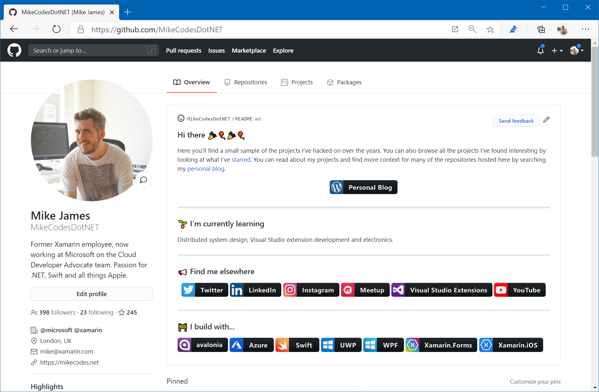

# Colored Badges for GitHub profiles
I've put together some badges I for my [GitHub profile readme](https://github.com/MikeCodesDotNET) as shown below and thought they might be useful to others. 

   

### How to add a readme on your profile

It's super simple! 

Create a new repo using your GitHub username as the repo name. Voilà! 🎉🎉🎉🎉

---

## Badges

All badges are available as both [SVG](https://github.com/MikeCodesDotNET/ColoredBadges/tree/master/svg) & [PNG](https://github.com/MikeCodesDotNET/ColoredBadges/tree/master/png). I've also included the original [Figma file](https://github.com/MikeCodesDotNET/ColoredBadges/raw/master/badges.fig) I used to create these should you want to edit. 

### Editing / Creating you own 
The [Figma file](https://github.com/MikeCodesDotNET/ColoredBadges/raw/master/badges.fig) contains a page detailing how to match the existing badge styles. 

---

### Missing a badge you want? 
Either create your own with the supplied files or create an [issue](https://github.com/MikeCodesDotNET/ColoredBadges/issues/new?body=I%27d+like+to+have+a+new+badge.%0A%0A---Request+Info:) and if enough others thumbs-up the issue then I'll do my best to get the badge made. 

---

# Badges 

## Blogging Platforms

    

   

     

     

     

     

      

---

## Developer Tech

### Frameworks 

    

     

    

     

     

    

    

    

     

    

     

### Languages 

    

     

     
 
    

    

    

    

    

    

    

    

    

    

### Misc

    

     

     

     

     

     

     

     

     

     

     

     

     

### Services 

   

   

   

   

   

   

   

   

   

   

  

### Tools  

   

   

   

   

   

   

   

   

   
  
   
  
   

   

   

   

   

   

   

   

--- 

## Devices / Manufacturers

    

    

    

    

    

    

    

    

    

---

## Pronouns 

    

    

    

---

## Social & Professional 

    
  
    

    

    

    

    

    

    

    

    

                                    

--- 

## Streaming & Videos

    
  
    

    

    

    

